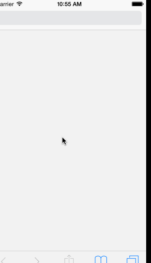
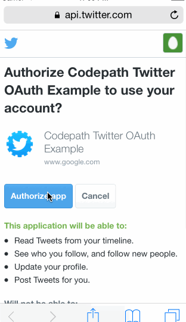

## Twitter

This is a basic twitter app to read and compose tweets the [Twitter API](https://apps.twitter.com/).

Time spent: 10

### Features

#### Required

- [x] User can sign in using OAuth login flow
- [x] User can view last 20 tweets from their home timeline
- [x] The current signed in user will be persisted across restarts
- [x] In the home timeline, user can view tweet with the user profile picture, username, tweet text, and timestamp.  In other words, design the custom cell with the proper Auto Layout settings.  You will also need to augment the model classes.
- [x] User can pull to refresh
- [x] User can compose a new tweet by tapping on a compose button.
- [ ] User can tap on a tweet to view it, with controls to retweet, favorite, and reply.
- [x] Profile page - Contains the user header view
- [x] Profile page - Contains a section with the users basic stats: # tweets, #
  following, # followers
- [x] Home timeline - Tapping on a user image should bring up that user's profile
  page
- [x] Hamburger menu - Dragging anywhere in the view should reveal the menu.
- [x] Hamburger menu - The menu can look similar to the LinkedIn menu below or
  feel free to take liberty with the UI.
- [x] Hamburger menu - The menu should include links to your profile, the home
  timeline, and the mentions view.

### Walkthrough

### Credits
[AppCoda](http://www.appcoda.com/sidebar-menu-swift/) and [SWRevealViewController](https://github.com/John-Lluch/SWRevealViewController) helped.
